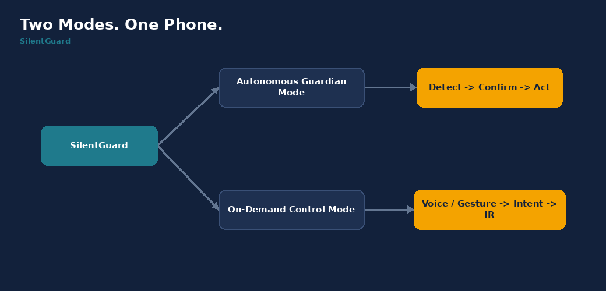
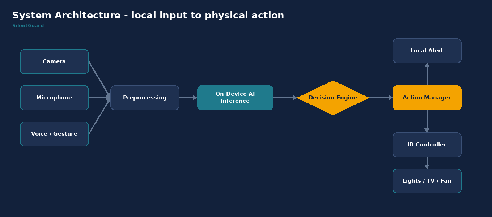
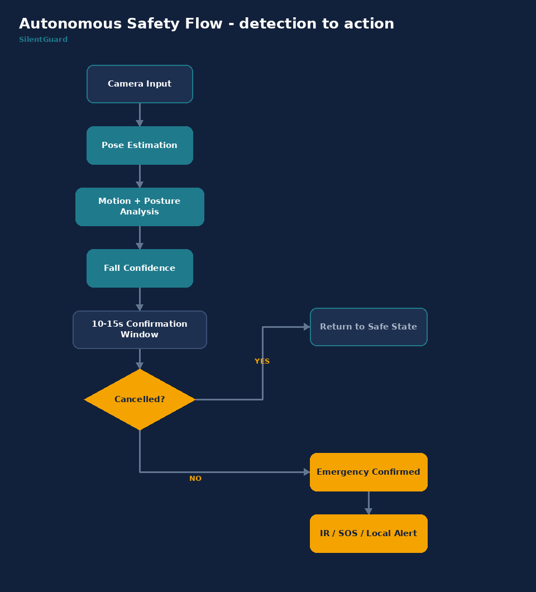
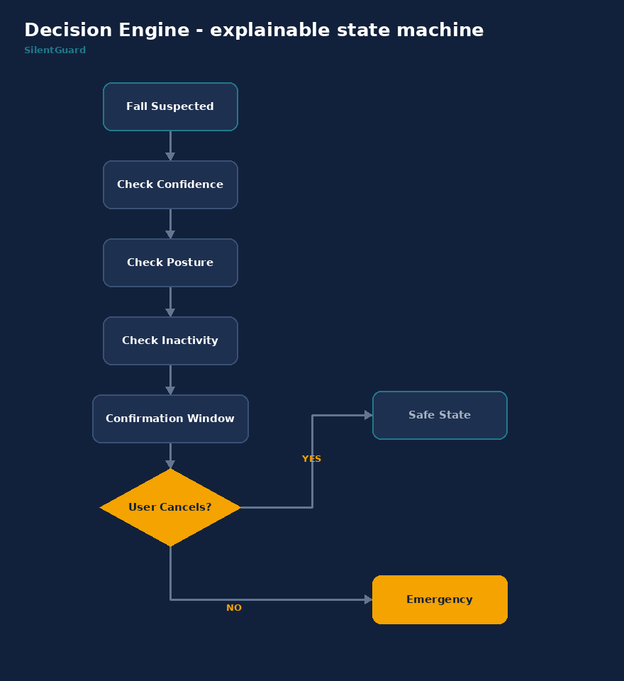
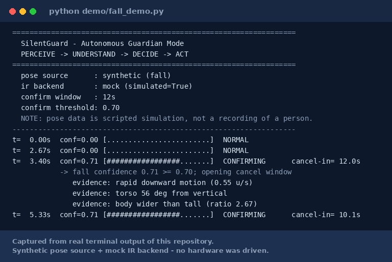
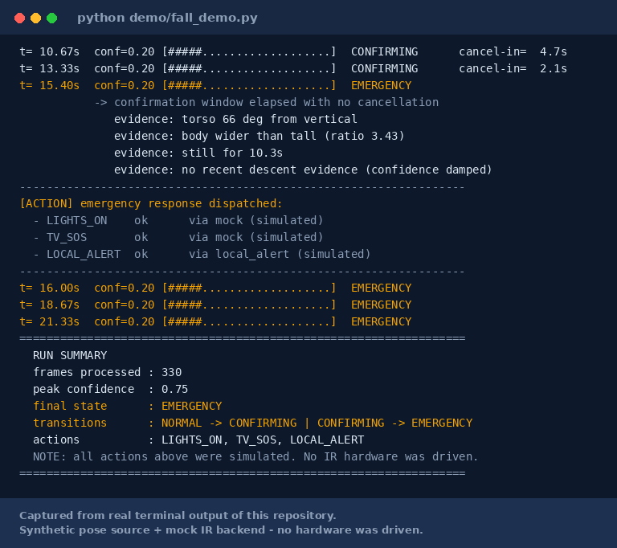
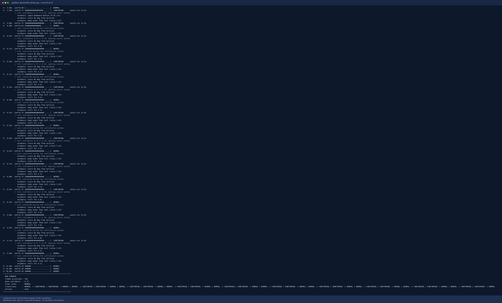
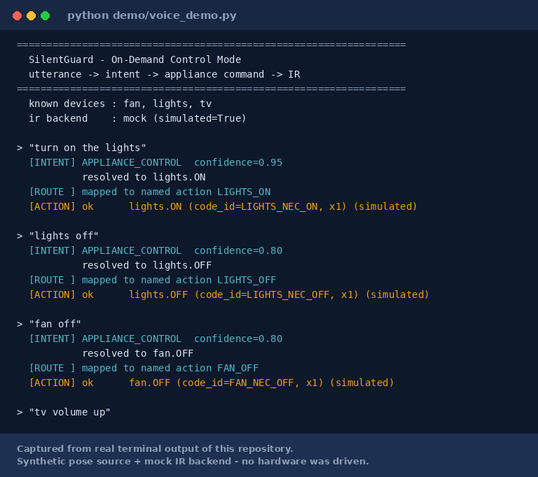

<div align="center">

# SilentGuard
### AI-Powered Autonomous Safety & Control System

**"When the user cannot act, SilentGuard can."**

*A smart home responds to commands. SilentGuard responds to situations.*

`PERCEIVE` → `UNDERSTAND` → `DECIDE` → `ACT`

</div>

---

> SilentGuard transforms a supported iQOO smartphone into an autonomous safety
> companion that can detect potential falls, reason about the event locally, and
> initiate a physical-world response through supported device capabilities.

Everything in this repository runs offline. There is no cloud call, no account,
and no subscription anywhere in the codebase.

---

## The problem

A person falls while alone. The failure is not that nobody *can* help — it is
that nobody *knows*. They may be unable to reach a phone, unlock it, find a
contact, or speak loudly enough to be heard.

Every existing option assumes a user who can still act:

| Option | What it gives up |
|---|---|
| Wearable fall sensor | Gets taken off, forgotten, left charging. Alerts, does not act. |
| Subscription camera | Needs internet and a monthly fee. Streams a private room off-site. |
| Generic voice assistant | Needs a spoken command — the exact thing a fall may prevent. |
| SOS button | Needs the user to reach it and press it. |

Full statement: [`docs/problem_statement.md`](docs/problem_statement.md)

## The solution

SilentGuard removes that assumption. The phone watches, reasons about what it
saw, waits for a chance to be wrong, and then acts on the room itself.

The differentiator is not fall detection, voice control, or notifications. It
is **AI perception + explainable decision-making + physical-world action, from
the smartphone.**

### Two modes, one phone



**Mode 1 — Autonomous Guardian.** The phone passively monitors for distress
using camera-based fall detection. The AI scores the event, a decision engine
confirms it, and the system triggers a response through IR appliance control
and local alerts. Trigger: a fall pattern.

**Mode 2 — On-Demand Control.** Voice or gesture commands control appliances
through the same action path. Trigger: a spoken command.

## Key capabilities

| Capability | Purpose |
|---|---|
| Fall Detection | Detect potential falls using pose and motion, not a single frame |
| Decision Engine | Reduce false triggers with explainable, configurable rules |
| Confirmation Window | 10–15s in which the user can cancel before anything happens |
| Autonomous Action | Trigger safety actions with no user input |
| IR Control | Drive supported appliances through the phone's IR blaster |
| Voice Control | Hands-free daily control through the same action layer |
| Offline Architecture | No mandatory cloud inference, anywhere |
| Privacy | Frames are scored and dropped; there is no upload path |

## Why iQOO is central

SilentGuard is built around two hardware properties a supported iQOO handset
has and most flagships do not:

- **An IR blaster** — the difference between a phone that *notifies* about an
  emergency and a phone that *acts* on the room. Most flagships omit it
  entirely, which makes the autonomous response physically impossible on them.
- **Flagship-tier NPU headroom** — enough to run pose inference locally, which
  is what makes the offline, no-subscription, no-upload architecture viable
  rather than aspirational.

Integration detail and honest limits: [`src/silentguard/platform/iqoo/README.md`](src/silentguard/platform/iqoo/README.md)

## Architecture



```
INPUT  ->  LOCAL INFERENCE  ->  LOCAL DECISION  ->  LOCAL ACTION
```

Designed around privacy-preserving on-device processing.
Full walkthrough: [`docs/technical_architecture.md`](docs/technical_architecture.md)

### How the AI pipeline works



A fall is never declared from one frame or one cue. Four independent signals
are scored and weighted:

| Signal | What it measures |
|---|---|
| Rapid descent | Peak downward hip velocity |
| Posture change | Torso angle from vertical |
| Horizontal state | Bounding-box width ÷ height |
| Sustained inactivity | Seconds of continuous stillness |

**Descent gates the score.** Without recent descent evidence the confidence is
damped to 35%, which is what separates a fall from someone lying on a sofa.
Every score carries its own explanation:

```
evidence: rapid downward motion (0.55 u/s)
evidence: torso 56 deg from vertical
evidence: body wider than tall (ratio 2.67)
```

Detail: [`docs/fall_detection.md`](docs/fall_detection.md)

### How the decision engine works



`NORMAL` → `FALL_SUSPECTED` → `CONFIRMING` → `EMERGENCY`, with cancellation as
the exit from `CONFIRMING`. The engine has no I/O and reads no clock — the
caller supplies the timestamp — so a 12-second window is deterministic under
test and identical at any frame rate.

Three properties the tests enforce: actions fire **exactly once**, a confirmed
emergency is **latched** against a later quiet frame, and a cancel is honoured
**only** while a window is open.

Detail: [`docs/decision_engine.md`](docs/decision_engine.md)

### How the physical action layer works

```
ActionManager
    -> CommandRegistry      resolves device + command -> code_id
    -> IRController         transmits (or refuses)
         MockIRController         development; prints, never transmits
         UnavailableIRController  selected but unbound; raises
         [device binding]         not implemented in this repository
```

Appliances are JSON profiles, so adding one is adding a file. Selecting a
device IR backend with no binding **raises rather than reporting success** — an
emergency system that fakes a success is worse than one that fails visibly.

Detail: [`docs/ir_integration.md`](docs/ir_integration.md)

## Quickstart

```bash
git clone <your-repo-url> SilentGuard
cd SilentGuard

python -m venv .venv
source .venv/bin/activate          # Windows: .venv\Scripts\activate

# Minimal: runs every demo below except live camera input, plus all tests.
pip install -r requirements-core.txt

# Full: adds MediaPipe + OpenCV for real camera/video, and Pillow for diagrams.
pip install -r requirements.txt
```

Python 3.10 or newer. No API key, no account, no `.env` required.

## Demos

### Autonomous guardian

```bash
python demo/fall_demo.py                      # scripted fall, no camera needed
python demo/fall_demo.py --scenario sit_down  # controlled descent: must NOT fire
python demo/fall_demo.py --scenario normal    # normal activity: must NOT fire
python demo/fall_demo.py --cancel-at 8        # user cancels inside the window
python demo/fall_demo.py --source mediapipe --video clip.mp4   # real video
python demo/fall_demo.py --source mediapipe --camera 0         # live camera
```

### On-demand control

```bash
python demo/voice_demo.py                          # scripted utterances
python demo/voice_demo.py --interactive            # type your own
python demo/voice_demo.py --say "turn on the lights"
```

### IR action layer

```bash
python demo/mock_ir_demo.py                        # profiles + emergency set
python demo/mock_ir_demo.py --device tv --command SOS
python demo/mock_ir_demo.py --backend device       # the honest failure path
```

## Sample output

```
t=  3.40s  conf=0.71 [#################.......]  CONFIRMING      cancel-in= 12.0s
           -> fall confidence 0.71 >= 0.70; opening cancel window
              evidence: rapid downward motion (0.55 u/s)
              evidence: torso 56 deg from vertical
              evidence: body wider than tall (ratio 2.67)
t= 15.40s  conf=0.20 [#####...................]  EMERGENCY
           -> confirmation window elapsed with no cancellation
------------------------------------------------------------------
[ACTION] emergency response dispatched:
  - LIGHTS_ON    ok      via mock (simulated)
  - TV_SOS       ok      via mock (simulated)
  - LOCAL_ALERT  ok      via local_alert (simulated)
------------------------------------------------------------------
  RUN SUMMARY
  frames processed : 330
  peak confidence  : 0.75
  final state      : EMERGENCY
  transitions      : NORMAL -> CONFIRMING | CONFIRMING -> EMERGENCY
  actions          : LIGHTS_ON, TV_SOS, LOCAL_ALERT
  NOTE: all actions above were simulated. No IR hardware was driven.
```

## Screenshots

Every image below is rendered from **real terminal output of this repository**,
captured by `python screenshots/capture.py`. None is mocked up, and each one
states on its face that the run used the synthetic pose source and the mock IR
backend.

| | |
|---|---|
| **Fall detected, window open**<br> | **Emergency confirmed, actions dispatched**<br> |
| **User cancels inside the window**<br> | **On-demand voice control**<br> |

IR layer: [`screenshots/ir_layer.png`](screenshots/ir_layer.png)

## Tests

```bash
python -m unittest discover -s tests -t tests   # no extra dependencies
pytest -q                                       # also supported
```

The `unittest` command above is the one used to verify this commit, and it
needs nothing beyond the core install. The tests are plain
`unittest.TestCase` classes, so `pytest` collects them too.

Sample output:

```
----------------------------------------------------------------------
Ran 105 tests in 0.60s

OK
```

| Test file | Covers |
|---|---|
| `test_fall_detector.py` | Pose geometry, motion features, four-signal scoring, sit-down rejection |
| `test_decision_engine.py` | State transitions, window timing, latching, cancellation, audio corroboration |
| `test_command_parser.py` | Synonyms, safety-phrase priority, registry validation, input rejection |
| `test_action_manager.py` | Command resolution, dispatch, mock IR, unbound-backend failure |
| `test_runtime.py` | End-to-end fall / normal / sit-down / cancel runs, audio mock |
| `test_config.py` | Loading, dotted lookup, weight-sum validation, overrides |

One bug these tests caught, recorded in the changelog: a confirmation window
opened at `t=0.0` never advanced, because `self._confirm_started_at or now`
treated a valid zero timestamp as absent.

## Implementation status

Truthful as of this commit. Nothing is listed as implemented that the code does
not do.

| Feature | Status |
|---|---|
| Pose-based fall detection (four signals, explainable) | **Implemented** |
| Temporal motion analysis (sliding window) | **Implemented** |
| Decision engine + state machine | **Implemented** |
| Confirmation / cancel window | **Implemented** |
| Action manager + appliance registry | **Implemented** |
| Mock IR action layer | **Implemented** |
| Local alert layer | **Implemented** |
| End-to-end runtime + 3 demos | **Implemented** |
| Unit test suite (105 tests) | **Implemented** |
| MediaPipe camera / video input | **Implemented** (needs `requirements.txt` install) |
| Voice command parsing | **Prototype** (text in; speech-to-text is an adapter) |
| Synthetic pose scenarios | **Prototype** (simulation, clearly labelled) |
| Device-specific IR transmission | **Integration layer only** — contract + mock, no transmission |
| Audio distress detection | **Extension** — interface + mock, no trained model |
| Gesture recognition | **Extension** — interface point only, no model |
| On-device NPU execution | **Future scope** — architected for it, not measured |
| Caregiver ecosystem | **Future scope** |

## Repository structure

```
SilentGuard/
├── README.md, LICENSE, CHANGELOG.md, pyproject.toml
├── requirements.txt, requirements-core.txt, .env.example, .gitignore
│
├── src/silentguard/
│   ├── runtime.py                 # wires the whole pipeline together
│   ├── perception/                # pose_detector, motion_analyzer, fall_detector
│   ├── decision/                  # decision_engine, states, thresholds
│   ├── actions/                   # action_manager, ir_controller, mock_ir, local_alert
│   ├── appliances/                # command_registry + profiles/*.json
│   ├── voice/                     # command_parser, intent
│   ├── audio/                     # detector_interface, mock_audio_detector (extension)
│   ├── platform/                  # contracts + android/ + iqoo/ integration notes
│   └── config/                    # config.yaml, loader
│
├── demo/                          # fall_demo, voice_demo, mock_ir_demo
├── tests/                         # 105 unit tests
├── architecture/                  # 4 Mermaid sources + rendered PNGs
├── docs/                          # 8 technical documents
├── screenshots/                   # real captured output + capture.py
└── models/                        # README only - no weights are vendored
```

## Technology stack

| Layer | Choice | Why |
|---|---|---|
| Language | Python 3.10+ | Fast to demonstrate the pipeline end to end |
| Vision | OpenCV | Video capture and colour conversion |
| Pose | MediaPipe Pose | Lightweight, on-device, no cloud call |
| Config | PyYAML | One file for every threshold |
| Diagrams | Mermaid + Pillow | Sources render on GitHub; PNGs for everything else |
| Tests | `unittest` (pytest-compatible) | Runs with zero extra dependencies |
| Device layer | Android / Kotlin (contracts only) | Documented seam, not a fabricated implementation |

Nothing was added to make the stack sound impressive. There is no database, no
web framework, and no cloud SDK, because none is needed.

## Configuration

Every threshold lives in
[`src/silentguard/config/config.yaml`](src/silentguard/config/config.yaml) —
fall confidence weights, descent velocity, posture angle, inactivity duration,
confirmation window length, appliance action map, IR backend, debug mode. No
magic numbers are scattered through the modules, and the loader validates that
the signal weights sum to 1.0.

## Privacy

| Property | Status in this repository |
|---|---|
| Network calls | **None** — no module imports an HTTP client or opens a socket |
| Frames written to disk | **None** — scored and dropped |
| Accounts or credentials | **None** |
| Retained state | A 4-second deque of landmark coordinates, in memory only |
| Telemetry | **None** |

Verify the first line yourself:

```bash
grep -rnE "requests|urllib|http|socket|boto3|firebase" src/
```

Detail: [`docs/privacy.md`](docs/privacy.md)

## Limitations

**This is a hackathon prototype. It is not a medical device, not an emergency
service, and not a substitute for one.**

There are **no accuracy figures, no false-alarm rate, no latency benchmarks and
no battery measurements** in this repository. Producing them requires a
labelled fall dataset and on-device evaluation, which this prototype does not
have — so rather than estimate them, none are given.

Known limits: camera placement and occlusion, low light, single-occupant
assumption, one-way IR with no confirmation of appliance state, no IR
transmission from this code, and no Android application.

Full list: [`docs/limitations.md`](docs/limitations.md)

## Future scope

Evaluation before expansion, then: on-device NPU port with real measurements, a
real IR binding, an audio distress classifier, gesture recognition, adaptive
per-household thresholds, and opt-in caregiver escalation.

Detail: [`docs/future_scope.md`](docs/future_scope.md)

## Documentation index

| Document | Contents |
|---|---|
| [`problem_statement.md`](docs/problem_statement.md) | Who this is for and what the gap is |
| [`technical_architecture.md`](docs/technical_architecture.md) | Layers, design rules, data flow |
| [`fall_detection.md`](docs/fall_detection.md) | The four signals and the descent gate |
| [`decision_engine.md`](docs/decision_engine.md) | States, window, guarantees, audio policy |
| [`ir_integration.md`](docs/ir_integration.md) | Profiles, code IDs, the device seam |
| [`privacy.md`](docs/privacy.md) | What the code does and does not retain |
| [`limitations.md`](docs/limitations.md) | Honest scope boundaries |
| [`future_scope.md`](docs/future_scope.md) | What comes next, in priority order |

## Team

*Replace this section with your team details before submission.*

| Name | Role |
|---|---|
| — | — |

## License

MIT — see [`LICENSE`](LICENSE).

---

<div align="center">

**SilentGuard — Safety That Doesn't Need a Signal.**

</div>
